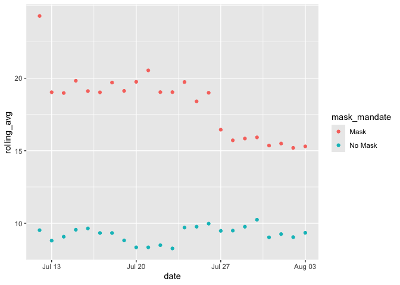
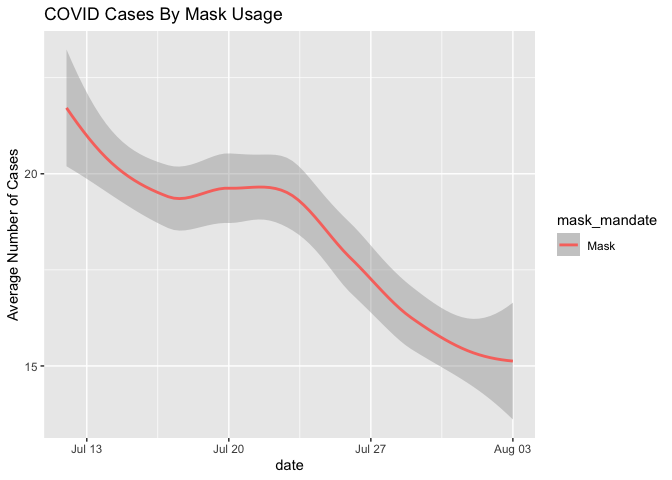

Lab 07 - Conveying the right message through visualisation
================
Tiffani J. Hill
February, 26, 2026

### Load packages and data

``` r
library(tidyverse) 
```

### Exercise 1

``` r
df <- read_csv("/Users/tiffani/Documents/GitHub/lab_07_betterviz/kansas_grouped_rolling_avg.csv")
```

    ## Rows: 46 Columns: 3
    ## ── Column specification ────────────────────────────────────────────────────────
    ## Delimiter: ","
    ## chr  (1): mask_mandate
    ## dbl  (1): rolling_avg
    ## date (1): date
    ## 
    ## ℹ Use `spec()` to retrieve the full column specification for this data.
    ## ℹ Specify the column types or set `show_col_types = FALSE` to quiet this message.

### Exercise 2

``` r
ggplot(df, aes(x = date, y = rolling_avg,
               color = mask_mandate)) +
  geom_point() +
   scale_y_continuous(breaks = c(0, 5, 10, 15, 20))
```

<!-- -->

``` r
  labs(title = "COVID Cases By Mask Usage",
       y = "Average Number of Cases")
```

    ## <ggplot2::labels> List of 2
    ##  $ y    : chr "Average Number of Cases"
    ##  $ title: chr "COVID Cases By Mask Usage"

### Exercise 3

The visualization standardizes the y axis and shows that the COVID cases
were lower for those who did not wear a mask. While this is the same
data used in the original graph, it was misleading because the values on
the y-axis for the mask-wearers were larger than the non-mask wearers.

\###Exercise 4 My visualization tells us that there were more documented
COVID cases for people that wear masks than those that don’t. However, I
think this is also misleading because the people who wear masks likely
get tested as higher rates than those that don’t.

\###Exercise 5 With the scales being equivalent, we see that the
original visualization was very misleading. My accurate visualization
shows that mask-wearers test positive for COVID-19 more than non-mask
wearers. The only change I made was the labeling of the axes since that
was the main aspect that was misleading.

\###Exercise 6 This plot conveys the message that masking reduces covid
cases over time. I removed the data from the people who don’t wear
masks. \###Exercise 7

``` r
df %>% 
  filter(mask_mandate == "Mask") %>% 
ggplot(aes(x = date, y = rolling_avg,
               color = mask_mandate)) +
  geom_smooth() +
   scale_y_continuous(breaks = c(0, 5, 10, 15, 20)) +
  labs(title = "COVID Cases By Mask Usage",
       y = "Average Number of Cases")
```

    ## `geom_smooth()` using method = 'loess' and formula = 'y ~ x'

<!-- -->
